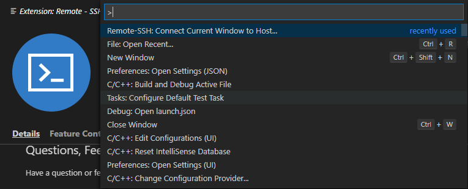
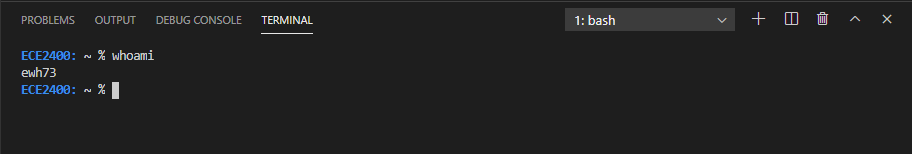
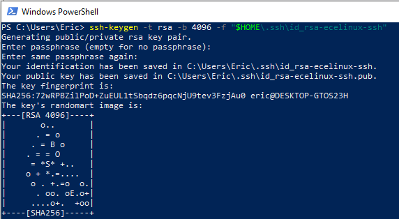

## Alternatives to X2Go:
- Visual Studio Code (VSCode)
  - Explored in the rest of the document.
- [MobaXTerm](https://mobaxterm.mobatek.net/download.html)
  - A plain terminal emulator with full ssh and X11 forwarding capability -- you can still use Geany, but don't have to work through the desktop first.

## Some Housekeeping:
- All keyboard shortcuts are written for Windows, though most should work on Mac if you substitute `cmd` for `ctrl`.
- This is **ENTIRELY OPTIONAL!**
  - You can excel in this course with the default setup, using X2Go and Geany or Micro (or any of the other editors, for that matter).
  - VSCode is merely an alternative with some advantages and disadvantages, the most apparent of which is that VSCode does *not* support remote desktop, screenshare, or GUI access.
- It is **HIGHLY** recommended that you install [git](https://git-scm.com/downloads) (https://git-scm.com/downloads) before downloading VSCode.
  - You can check for a git install by running `git --version` in a local terminal.
  - Having git pre-installed allows VSCode to automatically integrate with the toolchain, which will make your life easier in the future.
- If you need help with anything in this document, just like with any of the other tutorials, reach out. The course staff are here to help you!

# VSCode for ECE 2400
### Introduction to VSCode
VSCode is a free, lightweight text editor with a thriving ecosystem of extensions and plugins, allowing it to function as a full-featured IDE for languages from C to Javascript. You can download it from [here](https://code.visualstudio.com) (https://code.visualstudio.com), which also hosts a wonderful [Getting Started](https://code.visualstudio.com/docs) page.
- Extensions are installed from the aptly-named "Extensions" tab on the left sidebar, accessible by clicking the 'four blocks' symbol in the leftmost column, the keyboard shortcut `ctrl-shift-x`, from View->Extensions, or by typing "install extensions" and selecting "Extensions: Install Extensions" from the command palette (`ctrl-shift-p`).
- The command paletted (`ctrl-shift-p`) is VSCode's window to *everything*. It functions as a search window and interactive prompt for some commands, and is incredibly convenient.

### Extensions
Remember that extensions sidebar? You will need two at a bare minimum, though there are many, many others that you might find useful, and they can be disabled or uninstalled at any time if you decide you don't like what they do.
- The two required extensions:
  - C/C++ (by Microsoft)
  - Remote -- SSH (by Microsoft)
- Some other handy extensions:
  - Git History (by Don Jayamanne),
  - GitLens – Git Supercharged (by Eric Amodio)
  - C/C++ IntelliSense (by austin)
  - Visual Studio IntelliCode (by Microsoft)
  - Python (by Microsoft)
  - Remote – SSH: Editing Configuration Files (by Microsoft)
  - ... and many, many more.

### Remote Development with VSCode
1. Use `ctrl-shift-p` to open the Command Palette.
2. Start typing "connect current window to host" and select `Remote-SSH: Connect Current Window to Host...`



3. Select "Add New SSH Host" and type in the ssh command `ssh <netID>@ecelinux.ece.cornell.edu`, replacing `<netID>` with your netID.
4. VSCode should prompt you for your password, go ahead and provide it.
   - VSCode should now open into a blank window and do some setup on the server. Be patient, the first time can take a minute to complete.
5. Navigate your instance using the integrated terminal (access with the keyboard shortcut ```ctrl + ` ```).
   - You can open a folder in VSCode with `code .`, or individual files with `code <filename>`.
   - You can debug your compiled programs with perf & gdb, and use any of the other command-line programs... but nothing that uses X11 (like geany, or xeyes).
  


### Advanced: Setting up an SSH Key
You may have noticed that you'll have to keep providing your username and password whenever you want to use VSCode on the server. While this is secure, it is rather tedious. Instead, you can set up an SSH key to verify your identity when you login from your computer.

**NOTE: Reusing SSH keys is BAD PRACTICE! You should generate a different SSH key for the servers than you use for GitHub.**
**NOTE: Publishing your private SSH key *anywhere* is EXTREMELY BAD — grounds for being fired, kind of bad.**
**DO NOT PUSH A PRIVATE KEY TO GITHUB!**

1. Open up a *local* Powershell (Terminal, for Mac) instance, not a connection to the ECE Linux servers. 
   1. Use the ssh keygen utility (comes with git) to create an SSH keypair:
  *MACINTOSH:* 
  `ssh-keygen -t rsa -b 4096 -f "~/.ssh/id_rsa-ecelinux-ssh"`
  *WINDOWS:* 
  `ssh-keygen -t rsa -b 4096 -f "$HOME\.ssh\id_rsa-ecelinux-ssh"`
  (in this case, $HOME is the same thing as ~, the absolute path to your home directory).



(This is only a sample of what your screen should look like. I deleted this key immediately after taking this picture -- remember, **NO PUBLISHING KEYS**)

1. Copy the public key (extension `.pub`) into your clipboard.
   1. Open it in VSCode: `code $HOME\.ssh\id_rsa-ecelinux-ssh.pub` and copy the entire contents to your clipboard.

2. With your remote connection to the ECE Linux servers open in the terminal, navigate to your ssh directory: `cd ~/.ssh`.
   1. Open the `authorized_keys` file in VSCode by typing `code authorized_keys`. If it doesn't exist, don't worry – it will be created for you. Paste the public key onto its own line.

3. Now that the server knows to let you in when you try to log in with that SSH key, let's do that in VSCode. In your Remote-SSH Window, open the command palette `ctrl-shift-p` and select "Remote: Close Remote Connection", then "Remote: Connect Window to Host".
   1. This time, type `ssh -i ~/.ssh/id_rsa-ecelinux-ssh <netID>@ecelinux.ece.cornell.edu`. This will link the key you just generated to the server you're trying to join, so when you ssh into that server, VSCode will know to use the key.
   2. In the future, you will see `ecelinux.ece.cornell.edu` in the prompt when you use "Remote: Connect Window to Host". Selecting it is the same as typing out the command above, but a lot more convenient. Alternatively, you can click the Remote tab on the left sidebar, and select `ecelinux.ece.cornell.edu` from there.

## References and Resources
https://code.visualstudio.com/docs/remote/ssh 
- For more detail on the Remote extension and managing extensions on the server.