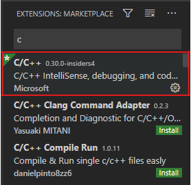

## Some Housekeeping:
- This is **ENTIRELY OPTIONAL!**
  - You can excel in this course with the default setup, using X2Go and Geany or Micro (or any of the other editors, for that matter).
  - VSCode is merely an alternative with some advantages and disadvantages, the most apparent of which is that VSCode does *not* support remote desktop, screenshare, or GUI access.
  - Following this tutorial does not break your X2Go setup!
- All keyboard shortcuts are written for Windows, though most should work on Mac if you substitute `cmd` for `ctrl`.
- It is **HIGHLY** recommended that you install [git](https://git-scm.com/downloads) (https://git-scm.com/downloads) before downloading VSCode.
  - You can check for a git install by running `git --version` in a local terminal.
  - Having git pre-installed allows VSCode to automatically integrate with the toolchain, which will make your life easier in the future.
- Unless otherwise specified, all steps should be completed on your local machine (e.g. laptop or desktop, *not* the ecelinux servers).
- If you need help with anything in this document, just like with any of the other tutorials, reach out. The course staff are here to help you!
  - Don't open Micro (or any other editor) in VSCode's terminal! By default, VSCode will consume keyboard shortcuts before they reach the terminal, so `ctrl-q` to close Micro *won't reach Micro!* Use `code /directory/or/filename` instead of `micro /path/to/filename`.

# VSCode for ECE 2400
### Introduction to VSCode
VSCode is a free, lightweight text editor with a thriving ecosystem of extensions and plugins, allowing it to function as a full-featured IDE for languages from C to Javascript. You can download it from [here](https://code.visualstudio.com) (https://code.visualstudio.com), which also hosts a wonderful [Getting Started](https://code.visualstudio.com/docs) page.
- Extensions are installed from the aptly-named "Extensions" tab on the left sidebar, accessible by clicking the 'four blocks' symbol in the leftmost column, the keyboard shortcut `ctrl-shift-x`, from View->Extensions, or by typing "install extensions" and selecting "Extensions: Install Extensions" from the command palette (`ctrl-shift-p`).
- The command paletted (`ctrl-shift-p`) is VSCode's window to *everything*. It functions as a search window and interactive prompt for some commands, and is incredibly convenient.

### Extensions
Remember that extensions sidebar? You will need two at a bare minimum, though there are many, many others that you might find useful, and they can be disabled or uninstalled at any time if you decide you don't like what they do. If your version numbers differ from the ones in the screenshot, don't worry. Most extensions update fairly frequently.
- The two required extensions:
  - C/C++ (by Microsoft)
  - Remote -- SSH (by Microsoft)

 

- Some other handy extensions:
  - Git History (by Don Jayamanne),
  - GitLens – Git Supercharged (by Eric Amodio)
  - C/C++ IntelliSense (by austin)
  - Visual Studio IntelliCode (by Microsoft)
  - Python (by Microsoft)
  - Remote – SSH: Editing Configuration Files (by Microsoft)
  - ... and many, many more.

### Remote Development with VSCode
1. Use `ctrl-shift-p` to open the Command Palette.
2. Start typing "connect current window to host" and select `Remote-SSH: Connect Current Window to Host...`


3. Select "Add New SSH Host" and type in the ssh command `ssh <netID>@ecelinux.ece.cornell.edu`, replacing `<netID>` with your netID.
4. VSCode should prompt you for your password, go ahead and provide it.
   - VSCode should now open into a blank window and do some setup on the server. Be patient, the first time can take a minute to complete.
   - If you get a warning about git version, remember to run `source setup-ece2400.sh --enable-auto-setup`.
5. Navigate your instance using the integrated terminal (access with the keyboard shortcut ```ctrl + ` ```).
   - You can open a folder in VSCode with `code .`, or individual files with `code <filename>`.
   - You can debug your compiled programs with perf & gdb, and use any of the other command-line programs... but nothing that uses X11 (like geany, or xeyes).
  


6. You'll need to install any extensions you want to use again on the server. Simply open the extensions tab with `ctrl-shift-x`, search up the extensions, and click "install on server". You only need to do this once, VSCode will remember what's installed.

## Further Reading
https://code.visualstudio.com/docs/remote/ssh 
- Includes instructions on how to use ssh profiles to login with keys instead of using your password each time.

https://code.visualstudio.com/docs/getstarted/keybindings
- Details on VSCode's keybindings.